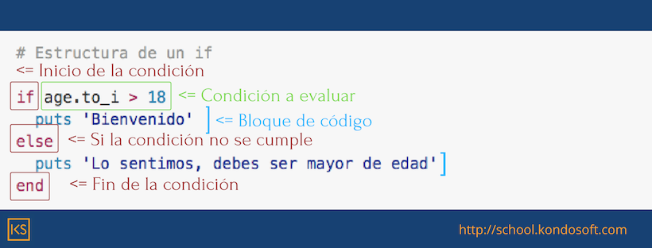

# Introduccion - Capitulo I

### En este capitulo aprenderas...

  En esta seccion, aprenderas a instalar Ruby, entender que es y como dunciona en terminos generales.
Aprenderas tambiena a interactuar con el lenguaje y crear archivos, su syntaxis basica y en escencia empezaras a usarlo.

### Que es Ruby

En informatica Ruby es un lenguaje de computacion de alto nivel e interpretado, si quieres aprender [que es un lenguaje interpretado](lenguajeInteptretado.md) te recomiendo el video en la de	descripcion.

Creado por Yukihiro Matsumoto, conocido en la comunidad como Matz, fue pensado para tener una sintaxis elegante y sencilla, ademas de ser totalmente orientado a objetos con algunos toques de programacion funcional.

### Por que ruby
	
Ruby es una gran opcion para quienes comienzan en el mundo de la programción, gracias a su sintaxis sencilla, se convierte en un lenguaje facil de aprender y muy poderoso.

### Instalando Ruby

En este video te ense;o la instalación de ruby
  - rbenv
  - que version de ruby
  - que es un repl

Una ves instalado Ruby,  comenzaremos a interactuar con el a traves de su REPL si no sabes aun [qu es un REPL](repl.md) te recomiendo ver mi video sobre ello.

### Primeros pasos

Asi que en tu terminal escribe ```irb```

Listo ya estas en la consola interactiba de Ruby, como puedes ver nos permite escribir, hagamos lo mas basico que todo programa debe hacer, una operacion matematica: ```2+2``` como puedes ver al dar enter el interprete evalua la operacion e imprime el resultado de dicha evaluacion, intentemos con otras operaciones...

```ruby
3-2
4*3
10/2
```

Tambien puedes hacer operaciones combinadas, sumas restas divisiones y multiplicaciones, te recomiendo que tomes algunos minutos para hacer tus propias pruebas.

Ruby tambien te permite usar `strings`, que es una manera de representar un texto, lo unico que tienes que hacer es encerrar tu texto entre comillas, pueden ser dobles o simples, personalmente recomiendo las simples, ya que es mas facil usar comillas dobles dentro de dicho texto y escribirlas en el teclado es mas sencillo.

```rb
'Texto con comillas simples'
"Texto con comillas dobles"
```


 #### irb (simple prompt)

Existe tambien el irb simple que a titulo personal disfruto considerabemente, solo neesitas tipear 
`irb --simple-prompt`

te recomiendo hacer una alias

para bash 
`echo "alias rub='irb --simple-prompt'" >> ~/.bash_profile`

para oh my zhell 
`echo "alias rub='irb --simple-prompt'" >> ~/.zshrc`

	
 #### Syntaxis basica de Ruby

Mientras tenemos abierta la terminal repasemos la sintaxis basica de Ruby, lo cual iremos haciendo con ejercicios, ya sabemos hacer operaciones matemeticas y escribir cadenas de texto, ahora necesitamos poder almacenar esos datos en algun lugar.

Hagamos uso de las variables, Ruby es un lenguaje de tipado debil, es decir no tenemos que decirle a Ruby que tipo de variable vamos a declarar.

Imagina que las variables son cordenadas en un casillero y qye el nombre que le asignemos es la coordenada de memoria.

```rb
nombre = 'Carlos'
apellido_paterno = 'Gonzalez'
apellido_materno = 'Vasconelos'
edad = '38'
empresa = 'KondoSoft'
```

Ahora escribamos cualquiera de esos datos y veras que Ruby se acuerda de los datos que le diste.

Ya sabemos usar variables, y hacer operaciones, intenta averiguar cuantas decadas he vivido...

Una decada son 10 años y solo deben contar las decadas completas, intentalo por tu cuenta, pausa el video 2 minutos y si no lo has resuelto aun regresa para que te explique la solución.


Si dividimos la edad entre 10 nos dira cuantas decadas cumplidas hay, asi que 
```edad/38```
 
?Sabes por que sucede este error?
 
Excato edad es una variable de texto, y queremos dividir un texto sobre 10, es imposible para Ruby, para hacer este texto un numero, o variable tipo entero usaremos el metodo `to_i`.

```rb
edad.to_i/10
catidad_decadas = edad.to_i/10
```

Como puedes ver, Ruby tiene metodos ya integrados para diferentes tipos de datos como `to_i` que convierte una cadena de texto a entero, ahora que tal si quiero saber el cuantas palabras tiene mi nombre?

```rb
nombre.length 
```

Ahora puedes ver que mi nombre tiene seis caracteres, en Ruby todos los tipos de datos tienen metodos integrados por le mismo lenguaje, hablaremos de ellos despues.

Ademas de hacer operaciones matematicas en Ruby podemos hacer comparaciones, supongamos queEstamos haciendo una lista de alumnos, pero necesitamos que los alumnos sean mayores de 18 años, para esto existen los operadores logicos.

```shell
>   # mayor que
<   # menor que
==  # igual
!=  # diferentes 
```

entonces podemos decir que 

```rb
edad.to_i > 18
```

Asi podemos decidir que si la edad del alumno es mayor a 18 este puede ser inscrito, hagamoslo:

Voy a ense;arte varios conceptos ahorita, asi que lo hare lo mas lento posible, si necesitas pausar el video o verlo de nuevo hazlo.

```rb
if edad.to_i > 18
	puts 'Bienvenido'
end
```

Como puedes ver acabamos de hacer una condicion, lo primero es identificar las palabras claves 
`if` 
y 
`end`
, que marcan el inicio y fin de la condicion, despues la evaluacion, o validacion 
`edad.to_i > 18`
esto debe regresar `true` o `false` que son valores verdadero y falso, si esta evaluacion se cumple entonces es `true`.

Todo lo que va entre `if` y `end` es un bloque de codigo que sucedera solo si la evaluacion se cumple, si no el interprete no lo ejecutara.

Notaras tambien que use la palabra `puts` que imprime en pantalla cualquier dato que le pasemos, por lo pronto pensaras que es repetitivo, explicare mas en unos momentos.

como puedes notar escribir la condicion en la terminal de Ruby no es muy comodo, es hora de 


//TODO - HACER DOCUMENTO CON RESUMEN

## Escribir nuestro primer programa

Desde tu terminal crea una carpeta que se llame `mi_primer_script` y situate en ella, si aun no eres muy habil en la terminal, te recomiendo ver el video 'Domina la terminal' y regresar despues.

dentro de la carpeta crearemos un archivo llamado students.rb y lo abriremos con nuestro editor de texto favorito.

dentro escribiremos nuestro script.

```rb
name = 'Carlos'
middle_name = 'Antonio'
first_last_name = 'Gonzalez'
second_last_name = 'Vasconelos'
age = '38'

# Es el alumo mayor de edad?

if age.to_i > 18
  puts 'Bienvenido'
end
```

Genial, vamos a ejecutar el script, desde la terminal escribe `ruby alumnos.rb`	esto ejecutara nuestro programa linea por linea.

Actualmente Carlos es mayor	de edad, pero que pasa si no lo es?		

```rb
name = 'Carlos'
middle_name = 'Antonio'
first_last_name = 'Gonzalez'
second_last_name = 'Vasconelos'
age = '17'

# Es el alumo mayor de edad?

if age.to_i > 18
  puts 'Bienvenido'
end
```																										
No pasa nada verdad?, necesitamos decirle a Ruby que hacer si la codicion no se cumple, asi que hagamos el caso.

```rb
name = 'Carlos'
middle_name = 'Antonio'
first_last_name = 'Gonzalez'
second_last_name = 'Vasconelos'
age = '17'

# Es el alumo mayor de edad?

if age.to_i > 18
  puts 'Bienvenido'
else
  puts 'Lo sentimos, debes ser mayor de edad'
end
```

Ejecutemos de nuevo el script.

Ahora si obtenemos respuesta, no les parece genial?


#### Estructura de un `if`.



Es muy importante comprender en el bloque de codigo puede ser del tama;o que quieras y contener la cantidad de instrucciones necesarias, por ejemplo...

```rb
name = 'Carlos'
middle_name = 'Antonio'
first_last_name = 'Gonzalez'
second_last_name = 'Vasconelos'
age = '17'

# Es el alumo mayor de edad?

if age.to_i > 18
  puts 'Bienvenido'
  puts name
else
  puts 'Lo sentimos, debes ser mayor de edad'
  puts name
  puts 'Lo sentimos, debes ser mayor de edad'
end
```


Ahora tenemos un programa que puede verificar que el alumno sea mayor de edad sin embargo hay un error en el codigo seguramente algunos ya se dieron cuenta, si es asi por que no me mandas un twitt con la manera correcta? solo usa el hashtag #jumpstartruby o dejame un comentario aqui abajo.

Si no lo has notado trata de probar el codigo y que falle, te propongo que le dediques al menos 10 minutos antes de ver la solución.

- Solucion

	intenta correr tu programa con un alumno de 18 años y dime que pasa y por que?  Hay varias maneras de solucionar el problema, te recomiendo que uses la mas explicita, que cuando alguien mas lea tu codigo sepa que pasa.	

```rb
name = 'Carlos'
middle_name = 'Antonio'
first_last_name = 'Gonzalez'
second_last_name = 'Vasconelos'
age = '17'

# Es el alumo mayor de edad?

if age.to_i >= 18
  puts 'Bienvenido'
  puts name
else
  puts 'Lo sentimos, debes ser mayor de edad'
  puts name
  puts 'Lo sentimos, debes ser mayor de edad'
end
```

Ahora si, nuestra condición esta bien escrita, ten cuidado con este tipo de cosas, son errores comunes.


## Resumen

Hasta ahora hemos aprendido a:
- Instalar Ruby
- Interactuar con la terminal de Ruby
- Operaciones matematicas
- Operaciones logicas
- Variables (String, Integer)
- Condiciones

Ya sabes lo básico de Ruby y puedes llamarte un desarrollador, aun hay mucho camino por delante, pero espero que estes tan emocionado como yo y sigamos avanzando, a partir de este punto empezaremos a hacer cosas mas complejas y terminaremos este programa de adminsion de alumnos.

Te veo en el Capitulo 2.